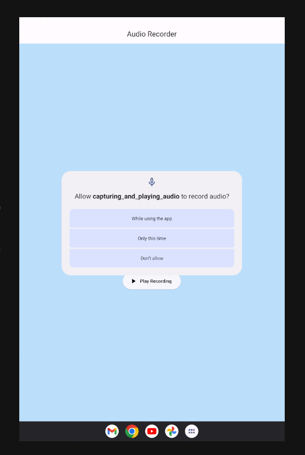
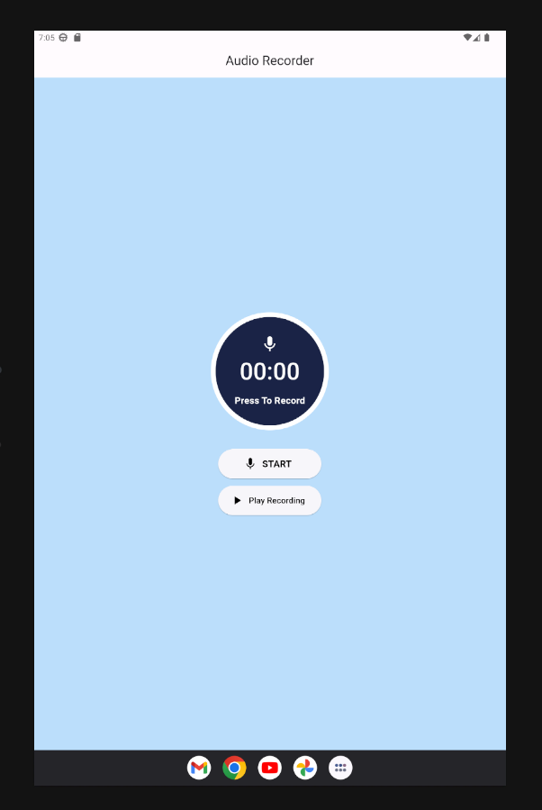
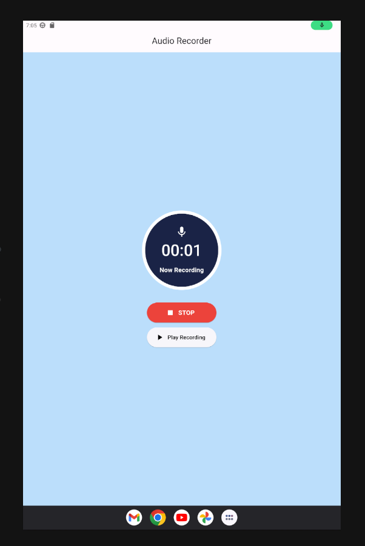
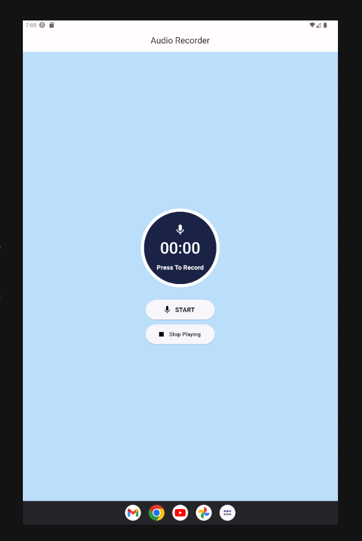
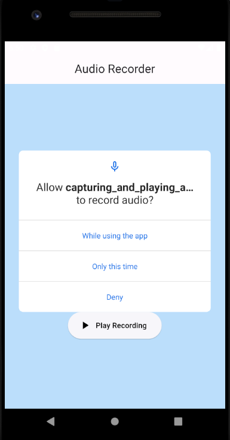
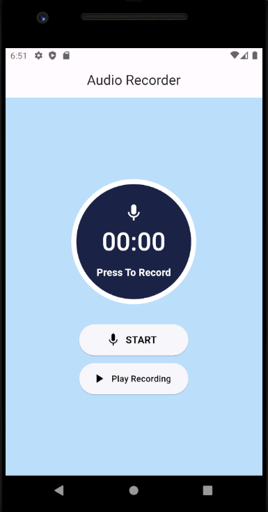
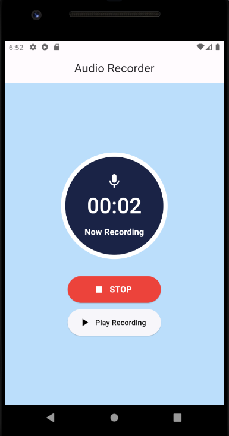
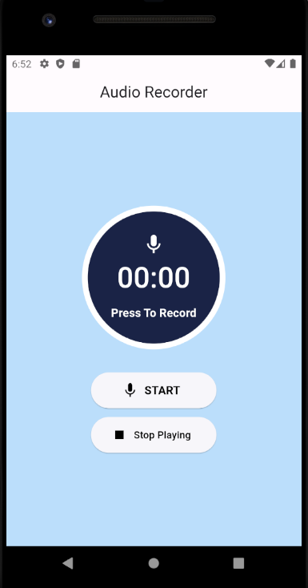

# Recorder & Audio Player

A Flutter Project to capture and play audio (Android & IOS).

  
  
  
  

  
  
  
  

## Languages, Frameworks and Libraries Used

- Flutter, Dart
- flutter_sound_lite
- flutter_glow
- permission_handler

#### License MIT
